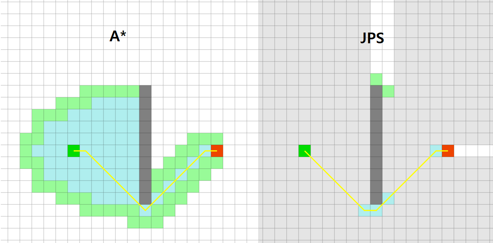

# JPS(B)

[Improving Jump Point Search (Daniel Harabor and Alban Grastien)](http://grastien.net/ban/articles/hg-icaps14.pdf)

JPS(B), JPS(BL) 를 참고해서 제작을 하였습니다.

캐리비안의해적, 크로스파이어, 창세기전, 건쉽 배틀 및 모든 신작 프로젝트의 

필드 길찾기 알고리즘에 공용으로 사용하고 있습니다.

</img>

## Youtube

## Compile

Visual Studio 를 기반으로 컴파일되도록 작성하였지만,

Windows, Android, IOS 환경에서도 테스트를 수행하였습니다.

## Description

JPS 의 가장 큰 부하인 Grid Scanning Time 을 줄이기 위한 다양한 방법 중에서

JPS 2011 다음의 알고리즘들은 다양한 선처리 연산을 하는데

충돌 맵의 정보가 계속 변하는 경우 선처리에 부담이 큰 알고리즘들은 배제를 하였습니다.

소스 코드의 형태는 JPS 구성에서 시작하여

최종적으로 JPS(B)의 형태로 수정을 하게되었습니다.

## Reference

[Improving Jump Point Search (Daniel Harabor and Alban Grastien)](http://grastien.net/ban/articles/hg-icaps14.pdf)

[narsue/BLJPS5](https://github.com/narsue/BLJPS5)
